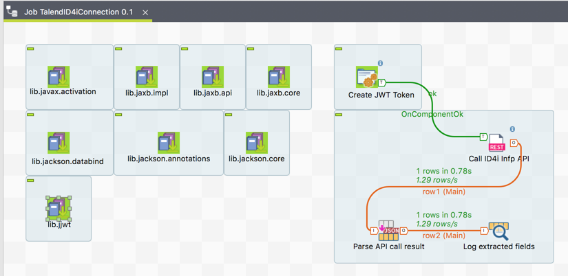
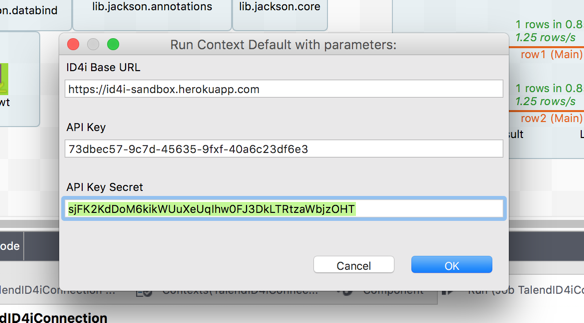
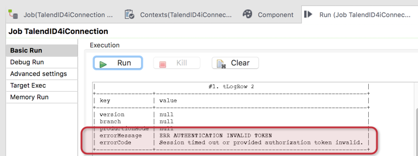
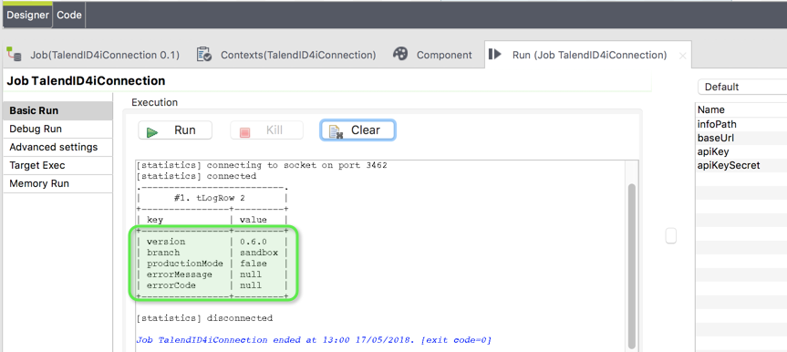

image:https://img.shields.io/gitter/room/nwjs/nw.js.svg?label=Support%20Chat[Support Chat,link=https://gitter.im/BlueRainSoftware/support]
image:https://img.shields.io/maven-central/v/de.id4i.api/id4i-api-client.svg?label=API%20Client%20Library[API Client Version, link=http://search.maven.org/#search%7Cga%7C1%7Ca%3A%22id4i-api-client%22]

= ID4i API Client Example - Talend Open Studio

ID4i provides globally unique IDs for single workpieces and a platform to manage, and exchange data bound to IDs in an inter-organizational manner. For details, please refer to http://id4i.de.

This repository contains a proof of concept for connecting to ID4i using Talend Open Studio.
For detailed documentation of ID4i see https://backend.id4i.de/docs/reference/en/reference.html

This example calls the API information resource from the ID4i API to demonstrate how connections to ID4i can be made from Talend Open Studio.
It contains the following components:

* Context configuration for URL and API Key
* `tLibraryLoad` for required libraries, most notably JJWT. The other libraries are required transistive dependencies of JJWT.
* `tJava` for creating the JWT token to sign the requests
* `tRest` to make the actual call
* `tExtractJSONFields` to parse the response from ID4i
* `tLogRow` to make the result visible

== Prerequisites

* Talend Open Studio - https://www.talend.com/products/talend-open-studio/
* Java 8
* JJWT 0.9.0 installed as library in Talend - http://search.maven.org/#artifactdetails%7Cio.jsonwebtoken%7Cjjwt%7C0.9.0%7Cjar

To be able to connect to ID4i with an API client, you need to register and set up an API key for
your application first. See  https://backend.id4i.de/docs/reference/en/reference.html#_preparation.

Using this key, you can sign https://jwt.io/[JWTs] to send as `Authorization` header `Bearer`token for
subsequent requests against the ID4i API.

Please refer to http://id4i.de on how to register and https://backend.id4i.de/docs/reference/en/reference.html for additional documentation.

== Run

. Import the project from this repository into TOS
+

. Run the project, enter the API key and secret you created in ID4i
+

. In case your talend installation misses any of the required libraries, you can get them from your local maven repository or from http://search.maven.org/

. If you did not activate the API key messed up creating the JWT, an error
+

. Otherwise: Fame & Profit
+

== Support

If you need support or just want to talk about ID4i, hop over to https://github.com/BlueRainSoftware/support, we're happy to help. You'll find additional pointers there.
